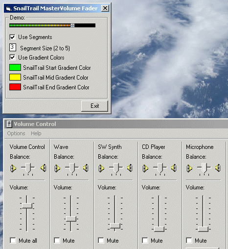



## SnailTrail Master Volume Fader Control

### Description

Simply a master volume fader control...Slider functionality piggybacked from Carles P.V.'s excellent cpvSlider submission. I added mixer api to control and detect changes in the sound volume as well as a routine to draw the snail trail...Also uses Paul Caton's excellent winsubhook typelib and timer class, included in the zip. Skinnable in that the slider thumb pic can be changed. Can also probably set the pic of your choice as the usercontrol background although I did not attempt that myself...

Happy Holidays!!!
 
### More Info
 

             |
---                |---
**Submitted On**   |2004-12-23 21:47:08
**By**             |[AlT](https://github.com/Planet-Source-Code/PSCIndex/blob/master/ByAuthor/alt.md)
**Level**          |Intermediate
**User Rating**    |5.0 (15 globes from 3 users)
**Compatibility**  |VB 6\.0
**Category**       |[Custom Controls/ Forms/  Menus](https://github.com/Planet-Source-Code/PSCIndex/blob/master/ByCategory/custom-controls-forms-menus__1-4.md)
**World**          |[Visual Basic](https://github.com/Planet-Source-Code/PSCIndex/blob/master/ByWorld/visual-basic.md)
**Archive File**   |[SnailTrail18328412232004\.zip](https://github.com/Planet-Source-Code/alt-snailtrail-master-volume-fader-control__1-57874/archive/master.zip)

